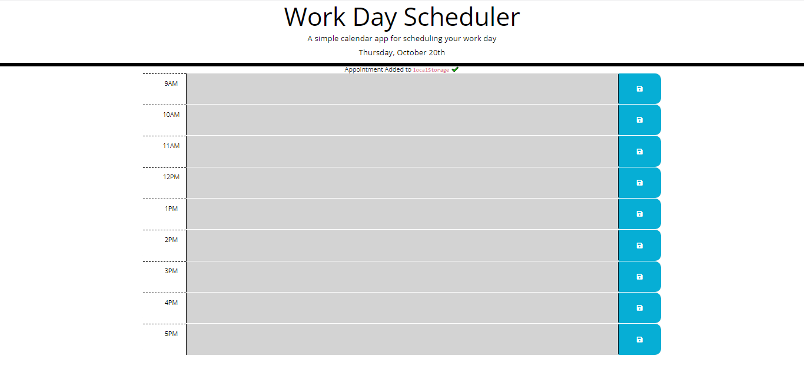

# challenge-5-APIs-zain-khawaja
https://zainkhawaja98.github.io/challenge-5-APIs-zain-khawaja/

## Description
The purpose of this website is to create a calendar application that allows a user to type information into a time block and save it for future use. This website is useful to keep track of your day to day schedule and allows changes to be made instantly. It solves the problem of not being organized with important things that have to be done during the day by a certain time. I learned how to work with APIs such as Moment and JQuery.
Provide a short description explaining the what, why, and how of your project. Use the following questions as a guide:

## Installation

N/A

## Usage
to use the website, type in infomation into any hour and click the save button. When the page is refreshed, the information will remain and will only be removed when deleted. It is organized by color so any hours that are in the past are in grey, hours in the present are red, and future hours are in green.

# Credits

N/A

## License

MIT License

Copyright (c) 2022 ZainKhawaja

Permission is hereby granted, free of charge, to any person obtaining a copy of this software and associated documentation files (the "Software"), to deal in the Software without restriction, including without limitation the rights to use, copy, modify, merge, publish, distribute, sublicense, and/or sell copies of the Software, and to permit persons to whom the Software is furnished to do so, subject to the following conditions:

The above copyright notice and this permission notice shall be included in all copies or substantial portions of the Software.

THE SOFTWARE IS PROVIDED "AS IS", WITHOUT WARRANTY OF ANY KIND, EXPRESS OR IMPLIED, INCLUDING BUT NOT LIMITED TO THE WARRANTIES OF MERCHANTABILITY, FITNESS FOR A PARTICULAR PURPOSE AND NONINFRINGEMENT. IN NO EVENT SHALL THE AUTHORS OR COPYRIGHT HOLDERS BE LIABLE FOR ANY CLAIM, DAMAGES OR OTHER LIABILITY, WHETHER IN AN ACTION OF CONTRACT, TORT OR OTHERWISE, ARISING FROM, OUT OF OR IN CONNECTION WITH THE SOFTWARE OR THE USE OR OTHER DEALINGS IN THE SOFTWARE.

---